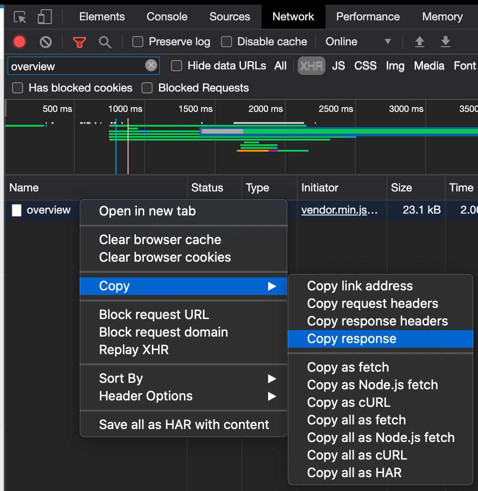
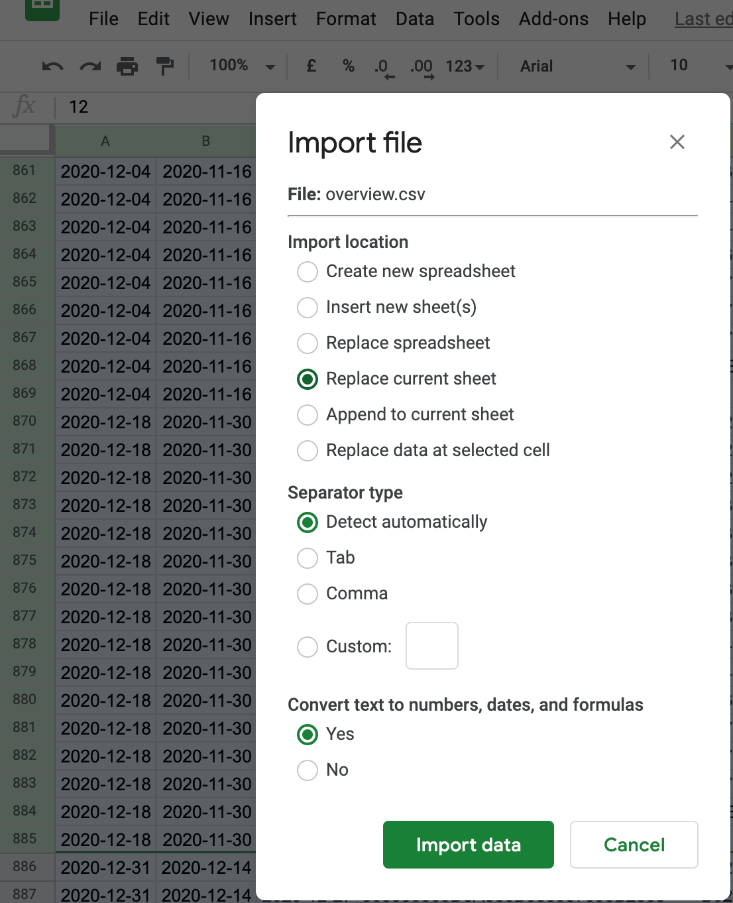
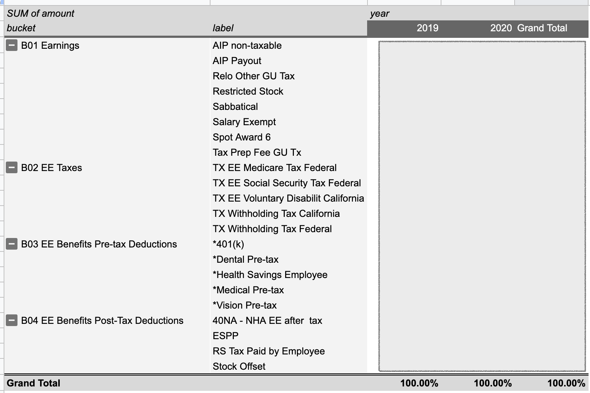

# ADP GlobalView paycheck analyzer

Simple tool to download your PayCheck into a flat CSV file so you can use it on a [Pivot Table](https://docs.google.com/spreadsheets/d/1-lHAEzu1DCGlIwAyJAPzzuWKM7NlHLbMs2rqguX59Bk/edit#gid=1263783736)

### Setup

1. create a new git directory `git init`
2. include this lib as submodule
```shell
git submodule add git@github.com:chernjie/adp-globalview.git lib
```
3. install dependencies
```shell
brew install jq nvm
nvm install 16
npm install --global json2csv hashable-cli
```

## Usage

1. Go to your ADP GlobalView > `myPay`
2. Open "network" console and search for "overview"
3. Right click on "overview" > "Copy" > "Copy response"
4. Save the response into a file "overview.json"
5. Flatten overview.json into `data/overview.csv`
```shell
mkdir -p data
jq -f lib/jq/overview.jq overview.json | npx json2csv --output data/overview.csv
```



6. Create a copy of https://docs.google.com/spreadsheets/d/1-lHAEzu1DCGlIwAyJAPzzuWKM7NlHLbMs2rqguX59Bk/edit#gid=1150223406

7. Upload `overview.csv` into the "overview" tab. Be sure to choose "Replace current sheet"



8. Pivot Table


